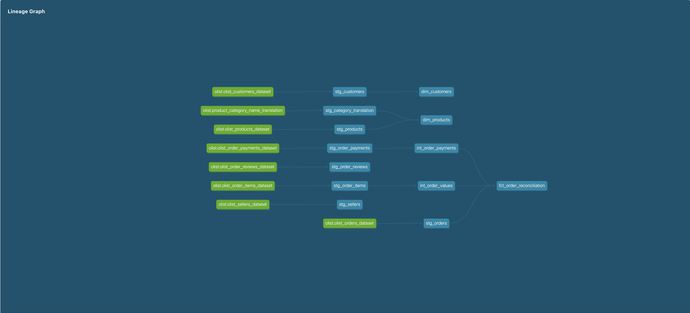
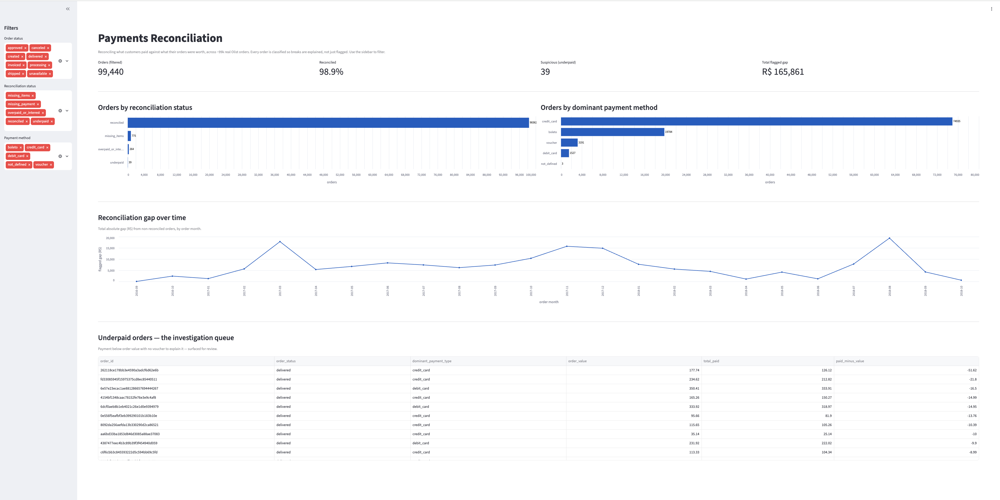

# Payments Analytics Pipeline


An end-to-end analytics-engineering pipeline on **real payments data**. It ingests the
public **Olist Brazilian E-Commerce** dataset (~99k orders), transforms it with **dbt Core**
through a **bronze → silver → gold** medallion architecture on **DuckDB**, enforces data
quality with **27 automated tests**, and ships a **payment reconciliation mart** that
surfaces and *explains* the gaps between what customers paid and what their orders were worth.

Built to mirror what fintech Analytics Engineer roles ask for: dbt, SQL, dimensional
modelling, data-quality testing, reconciliation, and CI — running entirely free and in the
browser (GitHub Codespaces + DuckDB), with no cloud costs.

## Key findings

Reconciling every order's payments against its item value classifies ~99k orders into a
clear triage — reconciled, explained-by-business-logic, or genuinely suspicious:

| Status | Orders | Meaning |
|---|---|---|
| `reconciled` | 98,362 (98.9%) | Payment matches order value within R$0.01 |
| `missing_items` | 775 | Order has a payment but no line items (referential gap) |
| `overpaid_or_interest` | 264 | Paid more — typically installment interest |
| `underpaid` | 39 | Paid less, **not** explained → investigation queue |
| `missing_payment` | 1 | Order has items but no payment |

The value here isn't counting mismatches — it's **triaging** them: separating the 98.9% that
are fine from the ~1% explained by installment interest or vouchers, down to the **39 orders**
(out of 99,441) that a real reconciliation process would actually hand to a human.

## Architecture

```
Kaggle (Olist CSVs)  ->  scripts/ingest.py  ->  data/landing/*.parquet (typed landing zone)
                                                        |
                                                        v
                                              dbt on DuckDB
                                    bronze (staging)  ->  silver (clean/model)  ->  gold (marts)
                                                        |
                        dbt tests + dbt-expectations  |  payment reconciliation mart  |  dbt docs
```



- **Bronze** (`stg_*`) — thin, typed, renamed views over each raw source. No business logic.
- **Silver** (`dim_*`, `int_*`) — cleaning, deduplication, business logic: customers deduped
  to real people, products joined to English categories, the two sides of reconciliation.
- **Gold** (`fct_order_reconciliation`) — the reconciliation mart, materialised as a table.

Materialisation strategy: bronze/silver as **views** (lightweight, always fresh), gold as a
**table** (fast to query). Compute-on-read where it's cheap, compute-on-build where it pays off.

## Dashboard

An interactive Streamlit dashboard over the gold mart — filters (order status, reconciliation
status, payment method), the status and payment-method breakdowns, the reconciliation gap over
time, and the underpaid-orders investigation queue.



```bash
streamlit run streamlit_app.py
```

## Data quality & CI

27 automated tests span five categories: `unique` / `not_null` on every key, `relationships`
(referential integrity — every item and payment points to a real order), `accepted_values`
(recon status and payment type constrained to known sets), and `dbt-expectations` value-range
checks (no negative money, review scores 1–5). **GitHub Actions runs the full build + all tests
on every push and pull request** against a coherent data sample, so broken logic can't merge.

## Tech stack

Python 3.11 · pandas · pyarrow · **dbt Core** · **dbt-duckdb** · **DuckDB** · Parquet ·
dbt-expectations · Streamlit · GitHub Actions · GitHub Codespaces

## Run it (GitHub Codespaces)

The repo is self-contained — the raw Olist CSVs are committed, so it runs with no downloads.

```bash
# 1. Land the raw CSVs as typed Parquet
python scripts/ingest.py

# 2. Build all models and run all tests
cd dbt_payments && dbt build

# 3. (optional) Browse the docs + lineage graph
dbt docs generate && dbt docs serve

# 4. (optional) Launch the dashboard
cd .. && streamlit run streamlit_app.py
```

## Project structure

```
.devcontainer/         Codespaces environment
.github/workflows/     CI (dbt build + tests on every push)
scripts/               ingest.py (CSV -> Parquet), fetch_data.py, make_sample.py
data/raw/              real Olist CSVs (committed)
data/sample/           small coherent sample used by CI
dbt_payments/          the dbt project (models, tests, sources)
streamlit_app.py       reconciliation dashboard
```

## What I'd improve next

- **Refine the voucher/discount logic** so some `underpaid` orders that are actually
  discount-related get reclassified out of the investigation queue.
- **Add a central `fact_order_items` + `dim_date`** to complete a textbook star schema
  alongside the reconciliation mart.
- **Swap DuckDB for a cloud warehouse** (Snowflake/BigQuery) — the dbt layer is identical;
  DuckDB is used here to demonstrate the patterns at zero cost.
- **Add orchestration** (dbt scheduled via Actions or Airflow) and source freshness tests.

## Data source & attribution

"Brazilian E-Commerce Public Dataset by Olist", published on Kaggle — real, anonymised
commercial data. Licensed **CC BY-NC-SA 4.0** (non-commercial). This is a non-commercial
portfolio project. https://www.kaggle.com/datasets/olistbr/brazilian-ecommerce
